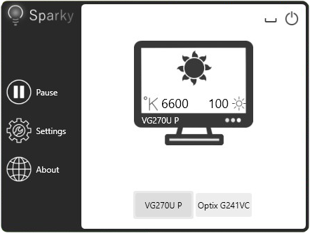
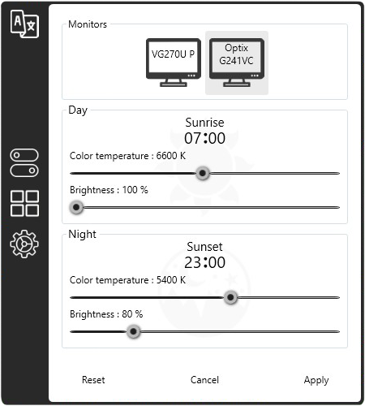

# Sparky ✨

**Sparky** is an application that reduces eyestrain produced by staring at a computer screen when working late hours.
As the day goes on, it continuously adjusts gamma, transitioning the display color temperature from cold blue in the afternoon to warm yellow during the night.
Its primary objective is to match the color of the screen to the light sources of your surrounding environment — sunlight during the day and artificial light during the night.
**Sparky** has minimal impact on performance and offers many customization options.

> ❔ If you have questions or issues, **please refer to the [wiki](https://github.com/xrAlex/Sparky/wiki)**.

> ⚠️ **Sparky** only works on Windows 7 and higher.
Other operating systems are not supported.

## Features

- Extensive customization options
- Whitelist for color-sensitive applications
- Smooth gamma transitions
- Minimal performance impact
- Works without internet connection
- Individual settings for each monitor

## Screenshots

